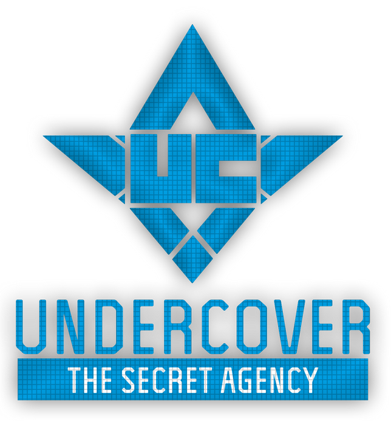
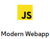

# UNDERCOVER Agent Onboarding Application

## ( Archived - Do not use - Top Secret)

This **modern web application** helps new hired Undercover Agents to get familiar with our systems.

It will provide all required information for Agents to log on the UnderCover Network system.

Simply deploy this application to a RedHat Openshift cluster running on IBM Cloud and access the generated web site.

### You need :

- A Web Browser
- Access to a RedHat OpenShift Cluster on IBM Cloud i.e. ROKS4.3
- This GitHub repository URL

## INSTRUCTIONS

- From your IBM Cloud console, access your cluster console as a `developer`
- Create new modern web application from this Git in `Undercover` project
  - Don't forget to create a `route` to access it
- Open your web browser 
- Use generated password with Undercover server

> Don't forget to change your password after first login

**<u>WELCOME ON BOARD NEW AGENT!!!</u>**

