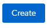

# UNDERCOVER Agent Onboarding Application

## ( Archived - Do not use - Top Secret)

This **modern web application** helps new hired Undercover Agents to get familiar with our systems.

It will provide all required information for Agents to log on the UnderCover Network system.

Simply deploy this application to a RedHat Openshift cluster running on IBM Cloud and access the generated web site.

### You need :

- A Web Browser
- Access to a RedHat OpenShift Cluster on IBM Cloud i.e. ROKS4.3
- This GitHub repository URL

## INSTRUCTIONS

- #### Log in IBM Cloud (https://cloud.ibm.com) 
- #### You need to find an Openshift Cluster
  
  - One said the famous hacker "Vincent Perrin" has open its account to every one.
    - You might find his account "under" your name  (click on your name in the console or [here](https://cloud.ibm.com/?bss_account=f8d190703020c2efd6f009d24c22a9af))
    - If you see a cluster, open it (or click [here](https://cloud.ibm.com/kubernetes/clusters/bt94gcmd0kj49ac7nfog/overview?bss_account=f8d190703020c2efd6f009d24c22a9af))

- #### Open the Openshift Console

  - You need to **allow pop-up** windows as a new tab will open
  - First access should take a few seconds

- #### **As a developer, <u>SELECT YOUR TEAM PROJECT</u> not "default" project**

  

- #### Create new modern web application **FROM GIT** from this Git in your team's project
  
  - Copy the URL from this Git repository
  
  - Check this a Modern Webapp
  
    
  
    - **<u>Change</u>** the name of your application
  
      
  
  - And hit the **Create** Button 
  
    - It takes a few minutes to build and deploy the application
    - Look at the logs if you want to discover under the cover

#### Once the application is deploy (blue circle), click on Open URL

#### Generate you One-time-password to unlock the undercover server

**<u>WELCOME ON BOARD NEW AGENT!!!</u>**

